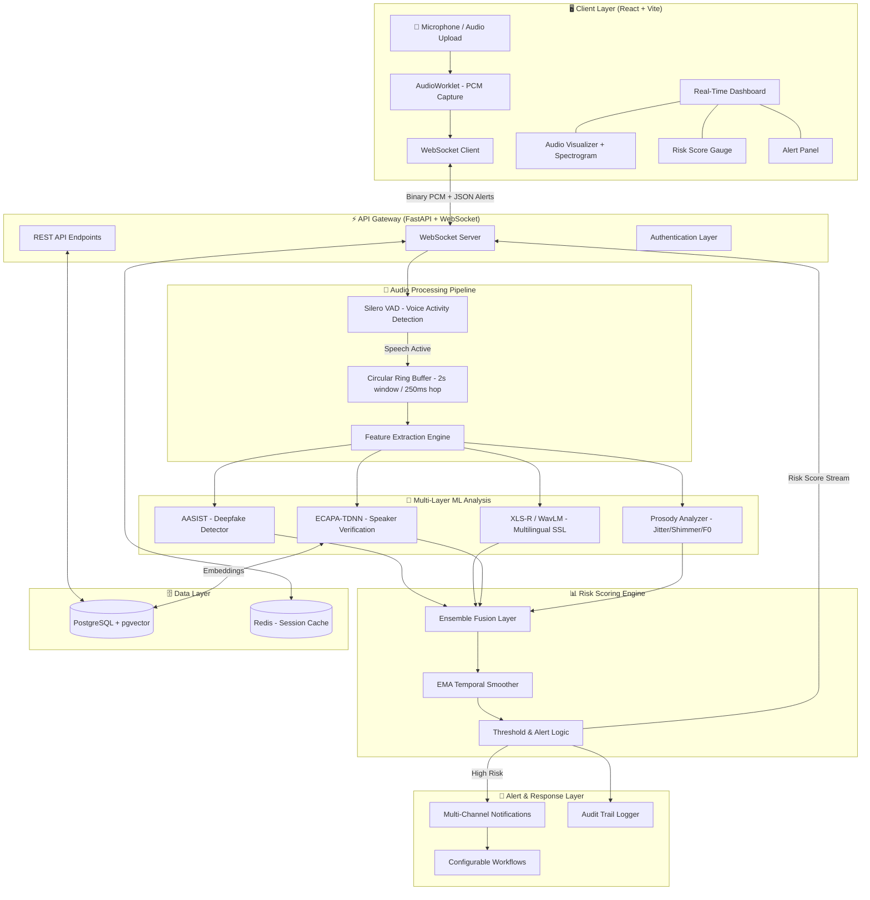

# VoiceGuardAI — AI-Powered Real-Time Voice Cloning Detection & Prevention Framework

## SIH26104 Implementation Plan

### Problem Summary

Voice cloning attacks using generative AI can now produce high-fidelity impersonations from seconds of audio. Current telephony systems lack real-time detection of synthetic/cloned speech, leaving financial institutions, enterprises, and government agencies vulnerable to fraud. We need an end-to-end framework that analyzes live voice streams, computes dynamic impersonation risk scores, and delivers actionable alerts — all while being privacy-preserving, scalable, and multilingual (with Indian language support).

---

## User Review Required

> [!IMPORTANT]
> **Scope Decision — Hackathon Prototype vs Production System**: This plan is structured as a **fully functional hackathon prototype** with a clear path to production scale. The prototype delivers all 5 key components from the problem statement with real ML models, real-time streaming, and a polished dashboard. Should I also include production-grade Kubernetes/Triton deployment configs, or keep focus on the working demo?

> [!IMPORTANT]
> **Model Selection**: The plan uses **AASIST** (raw waveform graph attention network) as the primary deepfake detector and **ECAPA-TDNN** (via SpeechBrain) for speaker verification. For Indian language support, we'll integrate **Wav2Vec2 XLS-R** as a multilingual backbone. Are you comfortable with these choices, or do you have access to specific pretrained models you'd prefer?

> [!WARNING]
> **GPU Requirement**: Real-time inference with WavLM/XLS-R models benefits significantly from GPU. The ONNX-quantized AASIST model can run on CPU with ~50ms latency per chunk. Do you have access to a CUDA-capable GPU for development, or should I optimize everything for CPU-only inference?

---

## Open Questions

1. **Deployment Target**: Will this be demonstrated locally (laptop), on a cloud VM (AWS/GCP/Azure), or both?
2. **Audio Source for Demo**: Should the demo support (a) live microphone input from browser, (b) uploaded audio file analysis, or (c) both? I recommend both for maximum demo impact.
3. **Database**: The plan uses PostgreSQL with pgvector for voice embeddings. Is a simpler SQLite option preferred for hackathon portability?
4. **Indian Language Priority**: Which specific Indian languages should be prioritized for testing? (Hindi, Tamil, Telugu, Bengali, Marathi, Kannada, etc.)

---

## Architecture Overview



---

## Technology Stack

| Layer | Technology | Rationale |
|:---|:---|:---|
| **Backend** | FastAPI (Python 3.11+, Uvicorn) | Native async WebSocket support, ultra-low overhead, Pydantic v2 validation |
| **Frontend** | React 18 (Vite) + TailwindCSS + shadcn/ui | Rich ecosystem, wavesurfer.js for audio viz, uPlot for real-time charts |
| **ML Framework** | PyTorch → ONNX Runtime | Train in PyTorch, deploy as optimized ONNX for 3-5x inference speedup |
| **Deepfake Detection** | AASIST (primary) + WavLM/XLS-R fine-tuned head | SOTA on ASVspoof benchmarks, graph attention captures spectro-temporal artifacts |
| **Speaker Verification** | ECAPA-TDNN (SpeechBrain) | 192-dim embeddings, industry standard, excellent short-utterance performance |
| **Prosody Analysis** | parselmouth (Praat) + pyworld | Jitter, shimmer, F0 micro-variations, formant dynamics |
| **VAD** | Silero VAD | Ultra-fast, saves 60-75% compute by skipping silence |
| **Database** | PostgreSQL 16 + pgvector | ACID compliance, native vector similarity for speaker embeddings |
| **Cache** | Redis | Session state, real-time pub/sub for alerts |
| **Streaming** | WebSocket (binary PCM) | Full-duplex, low-latency, universal browser support |
| **Deployment** | Docker Compose | Single-command setup for hackathon demo |

---

## Proposed Changes

### Component 1: Project Scaffolding & Configuration

#### [NEW] Project Root Structure
```
C:\Users\ashug\.gemini\antigravity\scratch\voice-sentinel\
├── backend/
│   ├── app/
│   │   ├── __init__.py
│   │   ├── main.py                    # FastAPI app, CORS, lifespan
│   │   ├── config.py                  # Pydantic Settings (thresholds, model paths)
│   │   ├── core/
│   │   │   ├── __init__.py
│   │   │   ├── audio_buffer.py        # Circular ring buffer
│   │   │   ├── vad.py                 # Silero VAD wrapper
│   │   │   └── feature_extraction.py  # LFCC, mel-spec, prosody features
│   │   ├── ml/
│   │   │   ├── __init__.py
│   │   │   ├── deepfake_detector.py   # AASIST / WavLM ONNX inference
│   │   │   ├── speaker_verifier.py    # ECAPA-TDNN embedding & cosine sim
│   │   │   ├── prosody_analyzer.py    # Jitter, shimmer, F0 analysis
│   │   │   ├── risk_scorer.py         # Ensemble fusion + EMA smoothing
│   │   │   └── models/               # .onnx model weights directory
│   │   ├── api/
│   │   │   ├── __init__.py
│   │   │   ├── websocket.py           # WebSocket audio streaming endpoint
│   │   │   ├── rest.py                # REST endpoints (profiles, alerts, history)
│   │   │   └── schemas.py             # Pydantic request/response models
│   │   ├── db/
│   │   │   ├── __init__.py
│   │   │   ├── database.py            # AsyncPG / SQLAlchemy setup
│   │   │   ├── models.py             # ORM models (voice_profiles, sessions, alerts)
│   │   │   └── crud.py                # Database operations
│   │   ├── alerts/
│   │   │   ├── __init__.py
│   │   │   ├── notifier.py            # Multi-channel alert dispatcher
│   │   │   └── workflows.py           # Configurable response workflows
│   │   └── privacy/
│   │       ├── __init__.py
│   │       └── anonymizer.py          # Feature-only logging, audio discard
│   ├── tests/
│   │   ├── test_audio_buffer.py
│   │   ├── test_vad.py
│   │   ├── test_deepfake_detector.py
│   │   ├── test_risk_scorer.py
│   │   └── test_websocket.py
│   ├── scripts/
│   │   ├── download_models.py         # Script to download pretrained models
│   │   └── export_onnx.py             # PyTorch → ONNX export utility
│   ├── requirements.txt
│   ├── Dockerfile
│   └── .env.example
├── frontend/
│   ├── src/
│   │   ├── App.tsx
│   │   ├── main.tsx
│   │   ├── components/
│   │   │   ├── Dashboard.tsx          # Main monitoring dashboard
│   │   │   ├── AudioVisualizer.tsx    # Waveform + spectrogram (Canvas)
│   │   │   ├── RiskGauge.tsx          # Animated risk score meter
│   │   │   ├── CallMonitor.tsx        # Active call session panel
│   │   │   ├── AlertPanel.tsx         # Alert history & notifications
│   │   │   ├── SpeakerProfile.tsx     # Voice enrollment & management
│   │   │   └── ui/                    # shadcn/ui components
│   │   ├── hooks/
│   │   │   ├── useAudioStreamer.ts     # Mic capture → WebSocket binary
│   │   │   ├── useRiskScore.ts        # Real-time risk score state
│   │   │   └── useWebSocket.ts        # WebSocket connection manager
│   │   ├── lib/
│   │   │   ├── audioProcessor.ts      # AudioWorklet PCM processing
│   │   │   └── api.ts                 # REST API client
│   │   ├── store/
│   │   │   └── useAppStore.ts         # Zustand global state
│   │   └── styles/
│   │       └── globals.css
│   ├── public/
│   │   └── audio-processor.js         # AudioWorklet processor script
│   ├── package.json
│   ├── tsconfig.json
│   ├── vite.config.ts
│   ├── tailwind.config.ts
│   └── Dockerfile
├── docker-compose.yml                 # Full stack orchestration
├── README.md
└── .gitignore
```

---

### Component 2: Backend — Audio Processing Pipeline

#### [NEW] `backend/app/core/audio_buffer.py`
Circular ring buffer for real-time streaming audio with configurable window and hop sizes.
- **Window**: 2.0s (32,000 samples at 16kHz) — sufficient temporal context for AASIST/WavLM
- **Hop**: 250ms (4,000 samples) — 75% overlap for smooth, continuous scoring
- Thread-safe deque-based implementation with `is_ready_for_inference()` gating

#### [NEW] `backend/app/core/vad.py`
Silero VAD integration for voice activity detection on incoming 30ms chunks.
- Drops silence/background noise before ML inference (saves ~60-75% compute)
- Returns speech probability per chunk; configurable threshold (default 0.5)
- Stateful: tracks speech onset/offset for session logging

#### [NEW] `backend/app/core/feature_extraction.py`
Multi-domain audio feature extraction:
- **LFCC** (Linear Frequency Cepstral Coefficients) via `torchaudio.transforms.LFCC` — captures high-frequency vocoder artifacts that MFCC misses
- **Log-Mel Spectrogram** — standard input for AASIST/WavLM models
- **Prosodic Features** — F0 contour (via pyworld), jitter, shimmer, HNR (via parselmouth)
- All features computed on GPU when available, with CPU fallback

---

### Component 3: Backend — Multi-Layer ML Analysis

#### [NEW] `backend/app/ml/deepfake_detector.py`
Primary deepfake/synthetic speech detection using ONNX Runtime:
- **AASIST Model**: Graph attention network operating on raw waveforms. Detects spectral and temporal synthesis artifacts simultaneously
  - Input: 2s raw audio tensor (1, 32000)
  - Output: Logits [bonafide, spoof] → sigmoid probability
  - ONNX exported with FP16 quantization for fast inference (~30-50ms on CPU)
- **WavLM/XLS-R + Linear Head** (optional multilingual branch):
  - SSL backbone extracts 768-dim frame embeddings
  - Lightweight linear classifier head for real/fake binary decision
  - Better generalization to unseen vocoders and Indian languages
- Inference via `asyncio.to_thread(ort_session.run, ...)` to keep event loop non-blocking

#### [NEW] `backend/app/ml/speaker_verifier.py`
Speaker identity verification using ECAPA-TDNN (SpeechBrain):
- Extracts 192-dim speaker embeddings from audio chunks
- Compares against enrolled voice profiles using cosine similarity
- Stores embeddings in PostgreSQL pgvector with HNSW indexing
- Cross-session consistency check: flags if speaker embedding drifts significantly mid-call
- Verification threshold configurable per security level (default cosine similarity > 0.75)

#### [NEW] `backend/app/ml/prosody_analyzer.py`
Behavioral and prosodic analysis to detect unnatural speech patterns:
- **F0 Microprosody**: Human speech has stochastic pitch micro-variations (jitter < 1%). Neural TTS produces unnaturally smooth or quantized pitch
- **Shimmer Analysis**: Cycle-to-cycle amplitude variation (natural shimmer < 3%)
- **Formant Dynamics**: Tracks F1-F4 formant trajectories; synthetic speech shows unnatural jumps or static bandwidths
- **Spectral Flatness**: Measures tonality vs. noise ratio; deepfakes often have artificially clean spectra
- Uses `parselmouth` (Praat wrapper) and `pyworld` for robust extraction

#### [NEW] `backend/app/ml/risk_scorer.py`
Ensemble fusion and temporal smoothing engine:
```
Risk Score Computation:
┌──────────────────────────────────────────────────────────┐
│                                                          │
│  S_final = w1 × S_deepfake     (AASIST/WavLM score)     │
│          + w2 × S_speaker      (Speaker mismatch score)  │
│          + w3 × S_prosody      (Prosodic anomaly score)  │
│          + w4 × S_context      (Metadata/context score)  │
│                                                          │
│  Default weights: w1=0.45, w2=0.25, w3=0.15, w4=0.15    │
│                                                          │
│  Temporal Smoothing (EMA):                               │
│  S̄_t = α × S_t + (1 - α) × S̄_{t-1},  α = 0.3          │
│                                                          │
│  Risk Levels:                                            │
│  • LOW    (0.0 - 0.3): Green — Normal speech             │
│  • MEDIUM (0.3 - 0.6): Yellow — Elevated, monitor        │
│  • HIGH   (0.6 - 0.8): Orange — Suspicious, warn user    │
│  • CRITICAL (0.8-1.0): Red — Likely synthetic, block      │
└──────────────────────────────────────────────────────────┘
```
- Configurable weights and thresholds per deployment scenario
- Contextual enrichment: call origin metadata, known contact matching, transaction context
- EMA smoothing prevents single-frame false alarm spikes

---

### Component 4: Backend — WebSocket Streaming & REST API

#### [NEW] `backend/app/api/websocket.py`
Real-time audio streaming endpoint:
```
Client                          Server
  │                                │
  │──── WS Connect ───────────────►│ Create session, init buffer
  │                                │
  │──── Binary PCM chunks ────────►│ VAD → Ring Buffer → ML Inference
  │     (100ms @ 16kHz = 3.2KB)    │
  │                                │
  │◄─── JSON Risk Score ──────────│ { score: 0.82, level: "CRITICAL",
  │     (every 250ms)              │   deepfake_prob: 0.91,
  │                                │   speaker_match: 0.34,
  │                                │   prosody_anomaly: 0.67,
  │                                │   alert: "Possible voice clone" }
  │                                │
  │──── WS Close ─────────────────►│ Save session, cleanup
```
- Handles binary PCM audio frames (16-bit, 16kHz, mono)
- Per-connection session state (ring buffer, model instances, speaker profile)
- Broadcasts risk scores back as JSON every 250ms
- Graceful connection lifecycle management

#### [NEW] `backend/app/api/rest.py`
RESTful API endpoints for non-realtime operations:
- `POST /api/v1/speakers/enroll` — Enroll a speaker voice profile (upload audio → extract embedding)
- `GET /api/v1/speakers/{id}` — Get speaker profile details
- `POST /api/v1/analyze/file` — Upload audio file for batch deepfake analysis
- `GET /api/v1/sessions` — List analysis sessions with risk summaries
- `GET /api/v1/sessions/{id}/timeline` — Get detailed risk score timeline for a session
- `GET /api/v1/alerts` — Query alert history with filtering
- `PUT /api/v1/config/thresholds` — Update risk thresholds dynamically
- `GET /api/v1/health` — Health check endpoint

#### [NEW] `backend/app/api/schemas.py`
Pydantic v2 schemas for all API contracts:
- `RiskScoreResponse`, `AlertResponse`, `SpeakerProfile`, `SessionSummary`
- `AnalysisConfig`, `ThresholdConfig`, `EnrollmentRequest`
- Strict validation with examples for OpenAPI documentation

---

### Component 5: Backend — Database & Models

#### [NEW] `backend/app/db/models.py`
SQLAlchemy ORM models with pgvector support:

| Table | Key Columns | Purpose |
|:---|:---|:---|
| `voice_profiles` | `id`, `user_id`, `name`, `embedding vector(192)`, `language`, `created_at` | Enrolled speaker embeddings for verification |
| `detection_sessions` | `session_id`, `caller_id`, `start_time`, `end_time`, `avg_risk_score`, `status` | Active/completed analysis sessions |
| `risk_telemetry` | `session_id`, `timestamp`, `chunk_index`, `risk_score`, `deepfake_prob`, `speaker_sim`, `prosody_score`, `anomaly_flags JSONB` | Per-chunk risk score time series |
| `alerts` | `id`, `session_id`, `severity`, `trigger_reason`, `risk_score`, `acknowledged_at`, `action_taken` | Generated alerts with resolution tracking |
| `audit_log` | `id`, `event_type`, `session_id`, `details JSONB`, `created_at` | Privacy-compliant audit trail |

---

### Component 6: Backend — Alerts & Privacy

#### [NEW] `backend/app/alerts/notifier.py`
Multi-channel alert dispatcher:
- **WebSocket Push**: Instant risk score updates to connected dashboard
- **In-App Notification**: Toast/banner alerts with severity color coding
- **Email/SMS** (pluggable): Integration points for SendGrid/Twilio (configurable)
- **Pre-Transaction Warnings**: Structured recommendations (call-back, MFA, escalation)

#### [NEW] `backend/app/alerts/workflows.py`
Configurable automated response workflows:
- Rule engine: IF risk_score > threshold AND context == "fund_transfer" THEN auto_hold + notify_supervisor
- Workflow templates for banking, enterprise, and government use cases
- Escalation chains with timeout-based auto-escalation

#### [NEW] `backend/app/privacy/anonymizer.py`
Privacy-preserving data handling:
- **Zero Raw Audio Retention**: PCM data discarded from memory immediately after feature extraction
- **Feature-Only Logging**: Only scalar scores, anomaly flags, and statistical summaries are persisted
- **Embedding Anonymization**: Optional McAdams coefficient pitch warping before storage
- **Configurable Retention**: Time-based auto-purge of telemetry data (default 90 days)
- **Compliance Modes**: DPDP Act 2023, GDPR, CCPA presets

---

### Component 7: Frontend — React Dashboard

#### [NEW] `frontend/src/components/Dashboard.tsx`
Main monitoring dashboard with responsive grid layout:
- **Active Calls Panel**: List of ongoing monitored sessions with live risk indicators
- **Risk Score History**: Time-series chart of risk scores across sessions
- **Alert Summary**: Recent alerts with severity breakdown
- **System Health**: Model inference latency, active connections, throughput

#### [NEW] `frontend/src/components/AudioVisualizer.tsx`
Real-time audio visualization using HTML5 Canvas + Web Audio API:
- **Waveform Oscilloscope**: Live PCM waveform rendering at 60fps via `requestAnimationFrame`
- **Live Spectrogram**: Scrolling frequency-domain heat map from `AnalyserNode.getByteFrequencyData()`
- **Spectral Features**: Visual overlay of detected anomaly regions
- Uses `wavesurfer.js` for recorded audio playback with timeline

#### [NEW] `frontend/src/components/RiskGauge.tsx`
Animated circular risk score meter:
- Color-coded: Green (LOW) → Yellow (MEDIUM) → Orange (HIGH) → Red (CRITICAL)
- Smooth animated transitions using CSS transforms
- Displays numeric score (0.00-1.00) and textual risk level
- Sub-scores breakdown (deepfake, speaker, prosody) as mini-bars

#### [NEW] `frontend/src/components/AlertPanel.tsx`
Alert management interface:
- Real-time alert feed with severity icons and timestamps
- Filterable by severity, session, time range
- Actionable buttons: Acknowledge, Escalate, Dismiss, Add Note
- Recommended actions display (e.g., "Initiate call-back verification")

#### [NEW] `frontend/src/components/SpeakerProfile.tsx`
Speaker enrollment and management:
- Record/upload voice sample for enrollment
- Display enrolled speaker details with embedding visualization (t-SNE plot)
- Edit/delete profiles, set verification thresholds per speaker

#### [NEW] `frontend/src/hooks/useAudioStreamer.ts`
Core audio capture and streaming hook:
- Captures microphone audio via `navigator.mediaDevices.getUserMedia`
- Processes through `AudioWorkletNode` (16kHz, mono, 16-bit PCM)
- Streams binary chunks over WebSocket at 100ms intervals
- Handles connection lifecycle, reconnection, and error states

#### [NEW] `frontend/src/hooks/useRiskScore.ts`
Real-time risk score state management:
- Receives JSON risk scores from WebSocket
- Maintains rolling history for chart rendering
- Triggers visual/audio alerts when thresholds crossed
- Debounces rapid state updates to prevent render thrashing

#### [NEW] `frontend/public/audio-processor.js`
AudioWorklet processor for browser-side audio capture:
- Runs on dedicated audio rendering thread (no main thread blocking)
- Converts Float32 → Int16 PCM format
- Configurable sample rate and buffer size
- Posts processed chunks to main thread via MessagePort

---

### Component 8: Docker & Deployment

#### [NEW] `docker-compose.yml`
Full-stack orchestration:
```yaml
services:
  backend:    # FastAPI + ONNX Runtime + ML models
  frontend:   # React (Vite) dev server / Nginx production
  postgres:   # PostgreSQL 16 + pgvector extension
  redis:      # Redis 7 for session cache & pub/sub
```
- Single `docker-compose up` to launch entire stack
- Volume mounts for ML model weights and database persistence
- Environment variable configuration via `.env`

#### [NEW] `backend/Dockerfile`
Multi-stage build:
- Stage 1: Python 3.11-slim + system deps (libsndfile, ffmpeg)
- Stage 2: pip install requirements + copy app code
- ONNX Runtime with CPU/CUDA provider auto-detection
- Target image size: ~1.2 GB

#### [NEW] `backend/scripts/download_models.py`
Automated model download script:
- Downloads AASIST pretrained weights from GitHub releases
- Downloads ECAPA-TDNN from SpeechBrain HuggingFace Hub
- Downloads Silero VAD from `snakers4/silero-vad`
- Optional: Downloads XLS-R/WavLM for multilingual support
- Exports all models to ONNX format with FP16 quantization
- Validates model integrity with checksums

---

### Component 9: ML Model Pipeline Details

#### Deepfake Detection Pipeline (per audio chunk)

```
┌─────────────────────────────────────────────────────────────────────────────┐
│                         Per-Chunk ML Inference Pipeline                     │
│                                                                             │
│  Input: 2.0s PCM audio (32,000 samples @ 16kHz)                           │
│                                                                             │
│  ┌─────────────────┐    ┌──────────────────┐    ┌────────────────────────┐  │
│  │ Branch 1: AASIST│    │ Branch 2: XLS-R  │    │ Branch 3: Prosody     │  │
│  │                 │    │ + Linear Head    │    │                        │  │
│  │ Raw waveform    │    │ SSL embeddings   │    │ F0 (pyworld)          │  │
│  │ → SincNet       │    │ → Mean pooling   │    │ Jitter (parselmouth)  │  │
│  │ → Graph Attn    │    │ → Linear(768,2)  │    │ Shimmer               │  │
│  │ → Logits        │    │ → Logits         │    │ Spectral Flatness     │  │
│  │                 │    │                  │    │ → Anomaly Score       │  │
│  │ Score: 0.91     │    │ Score: 0.87      │    │ Score: 0.67           │  │
│  └────────┬────────┘    └────────┬─────────┘    └────────┬───────────────┘  │
│           │                      │                       │                  │
│           └──────────────────────┴───────────────────────┘                  │
│                                  │                                          │
│                    ┌─────────────▼──────────────┐                           │
│                    │ Weighted Ensemble Fusion   │                           │
│                    │ + Speaker Verification Sim │                           │
│                    │ + Context Enrichment       │                           │
│                    └─────────────┬──────────────┘                           │
│                                  │                                          │
│                    ┌─────────────▼──────────────┐                           │
│                    │ EMA Smoothed Risk Score    │                           │
│                    │ Final: 0.82 → CRITICAL     │                           │
│                    └───────────────────────────-─┘                           │
└─────────────────────────────────────────────────────────────────────────────┘
```

#### Datasets for Training & Evaluation

| Dataset | Languages | Size | Use |
|:---|:---|:---|:---|
| ASVspoof 2019 LA | English | ~25K utterances | Primary training & baseline eval |
| ASVspoof 2021 DF | English (degraded) | ~600K utterances | Codec robustness testing |
| In-The-Wild | English | ~20K real-world deepfakes | Real-world generalization eval |
| WaveFake | English, Japanese | ~117K clips (6 vocoders) | Multi-vocoder robustness |
| IndicSynth | 12 Indian languages | Multi-lang synthetic speech | Indian language evaluation |
| AI4Bharat IndicVoices | 22 Indian languages | 10,000+ hours | Multilingual fine-tuning backbone |
| VoxCeleb 1 & 2 | Multilingual | 7000+ speakers | Speaker verification training |

---

### Component 10: Indian Language & Multilingual Support

**Strategy**: Language-agnostic artifact detection + language-specific acoustic modeling

1. **Backbone**: Use **Wav2Vec2 XLS-R (300M)** pretrained on 128 languages including Hindi, Tamil, Telugu, Bengali, Marathi — provides robust multilingual phonemic representations
2. **Fine-tuning**: Fine-tune the forensic classification head on IndicSynth dataset for Indian deepfake detection
3. **Code-Switching Handling**: The XLS-R model naturally handles Hinglish/Tanglish/Kanglish code-switching through its multilingual pretraining
4. **Telephony Robustness**: Train with AMR-NB (8kHz) and AMR-WB (16kHz) codec augmentation to handle Indian telephony bandwidth constraints
5. **Accent Robustness**: Data augmentation with IndicVoices samples across regional accents

---

## Verification Plan

### Automated Tests

```bash
# Unit tests for audio processing pipeline
pytest backend/tests/test_audio_buffer.py -v
pytest backend/tests/test_vad.py -v

# ML model inference tests
pytest backend/tests/test_deepfake_detector.py -v

# Risk scoring logic tests
pytest backend/tests/test_risk_scorer.py -v

# WebSocket integration tests
pytest backend/tests/test_websocket.py -v

# Full stack smoke test
docker-compose up -d && pytest backend/tests/ -v --timeout=60
```

### Manual Verification

1. **Live Demo Flow**:
   - Open dashboard in browser → click "Start Monitoring" → speak into microphone
   - Verify waveform/spectrogram renders in real-time
   - Verify risk score updates every 250ms with smooth animation
   - Play a known AI-generated voice sample → verify HIGH/CRITICAL alert triggers
   - Play genuine speech → verify LOW risk score

2. **File Upload Flow**:
   - Upload a genuine audio file → verify LOW risk score
   - Upload a deepfake audio file (from ASVspoof/WaveFake) → verify HIGH risk score
   - Verify detailed analysis report with per-feature breakdown

3. **Speaker Verification Flow**:
   - Enroll a speaker via voice recording
   - Verify same speaker matches with high cosine similarity
   - Verify different speaker shows low similarity / triggers alert

4. **Latency Benchmarks**:
   - Target: End-to-end latency < 400ms (from audio chunk to risk score display)
   - Target: AASIST ONNX inference < 50ms per chunk on CPU
   - Target: WebSocket round-trip < 20ms

5. **Accuracy Benchmarks** (on ASVspoof 2019 LA eval set):
   - Target EER: < 5%
   - Target min t-DCF: < 0.15

---

## Implementation Timeline (Suggested)

| Phase | Duration | Deliverable |
|:---|:---|:---|
| **Phase 1**: Core Pipeline | 2-3 days | Audio buffer, VAD, AASIST inference, WebSocket streaming |
| **Phase 2**: ML Ensemble | 2-3 days | Speaker verification, prosody analysis, risk scoring engine |
| **Phase 3**: Frontend Dashboard | 2-3 days | React dashboard, audio visualizer, risk gauge, alerts |
| **Phase 4**: Database & APIs | 1-2 days | PostgreSQL schema, REST endpoints, speaker enrollment |
| **Phase 5**: Privacy & Alerts | 1 day | Privacy module, multi-channel alerts, workflows |
| **Phase 6**: Docker & Polish | 1-2 days | Docker Compose, model download scripts, README, demo prep |
| **Phase 7**: Testing & Benchmarks | 1-2 days | Unit tests, integration tests, accuracy/latency benchmarks |
